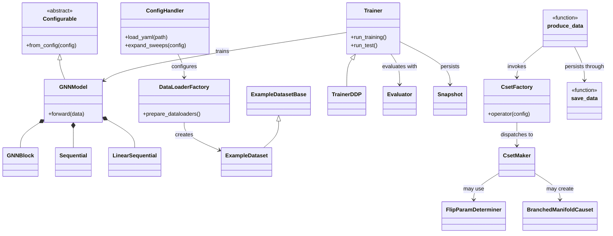
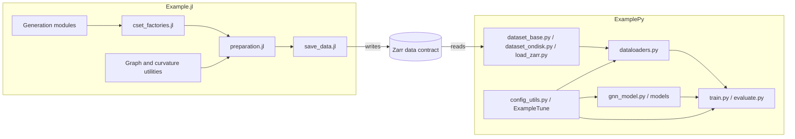

# Example Codebase Overview

> **Summary:** This two-package repository generates Zarr datasets in Julia, then reads those datasets in Python to train and evaluate configurable graph neural networks.

## Repository map

```text
.
├── Example.jl/              # Julia data-generation package
│   ├── configs/             # Data-generation configuration
│   ├── docs/                # Julia package documentation
│   ├── examples/            # Example generation configuration
│   ├── src/                 # Generators, graph utilities, and persistence
│   └── test/                # Julia unit and integration tests
├── ExamplePy/               # Python ML package
│   ├── configs/             # Training and tuning configuration
│   ├── docs/                # User and API documentation
│   ├── src/Example/         # Datasets, models, training, and evaluation
│   └── test/                # Python tests and fixtures
├── AGENTS.md                # Contributor and architecture guidance
└── README.md                # Installation and project overview
```

The packages meet at the persisted Zarr schema: `Example.jl` writes datasets and `ExamplePy` consumes them.

## Tech stack and paradigms

| Area | Technologies | Dominant paradigms |
|---|---|---|
| Python ML | Python, PyTorch, PyTorch Geometric, Zarr, NumPy, pandas, Optuna | Configurable object composition, dataset adapters, training orchestration, unit and integration tests |
| Julia generation | Julia, Zarr.jl, LinearAlgebra.jl, SparseArrays.jl, Distributed | Multiple dispatch, callable structs, functional numerical transforms, distributed generation |
| Configuration and tooling | YAML, JSON schemas, pytest, Julia `Pkg.test` | Configuration-driven construction and schema validation |

## Class/function diagram



## Class, struct, and important-function descriptions

### Python core and models

- **`Configurable`** defines the `from_config` construction contract.
- **`ConfigHandler` / `PyObjectTag`** load YAML tags, references, sweeps, ranges, and random values.
- **`GNNModel`** assembles an encoder, graph layers, pooling or latent path, optional graph features, and task heads.
- **`GNNBlock`** combines graph convolution, normalization, activation, residual behavior, and dropout.
- **`Sequential` and `LinearSequential`** provide configurable graph and dense component sequences.
- **`Snapshot`** carries checkpoint state.
- **`Trainer` / `TrainerDDP`** orchestrate training, resume, validation, testing, checkpointing, and distributed execution.

### Python data and evaluation

- **`ExampleDatasetBase`** validates files and handles metadata and chunks for Zarr-backed data.
- **`ExampleDataset`** maps global indices to Zarr records or processed PyTorch Geometric tensors.
- **`DataLoaderFactory`** builds stage-specific datasets, splits, and loaders; its distributed variant adds DDP samplers.
- **`Evaluator`, `Tester`, and `Validator`** aggregate task losses and metrics into reports.
- **`DefaultEarlyStopping`** applies metric patience and grace-period rules.

### Julia generation

- **`CsetFactory`** dispatches to the causal-set maker selected by configuration.
- **Maker structs** validate schemas and generate polynomial, layered, random, destroyed, grid-like, complex-top, or merged causal sets.
- **`FlipParamDeterminer`** finds parameters for connectivity-targeted random causal sets.
- **`BranchedManifoldCauset`** integrates a custom causal-set type with `CausalSets` methods.
- **`produce_data`** distributes generation work and sends results to persistence.
- **`save_data`** converts nested result dictionaries into the shared Zarr representation.

## Module diagram



## Module descriptions

### `ExamplePy/src/Example`

- `config_utils.py` and `utils.py`: YAML tags, configuration sweeps, imports, paths, and seeding.
- `dataset_base.py`, `dataset_ondisk.py`, and `load_zarr.py`: Zarr access, metadata, and PyTorch Geometric conversion.
- `dataloaders.py`: stage-aware splitting and local or distributed loaders.
- `gnn_model.py` and `models/`: configurable GNN assembly and reusable components.
- `evaluate.py`, `early_stopping.py`, `train.py`, and `train_ddp.py`: metrics, stopping, checkpoints, training, testing, and DDP.
- `ExampleTune/tune.py`: Optuna integration for YAML sweep, range, and random tags.

### `Example.jl/src`

- `Example.jl`: package module and public API exports.
- Generation modules: causal-set generation variants, branching, grids, merging, and perturbation.
- `graph_utils.jl`, `curvature_on_manifold.jl`, and `utils.jl`: graph algorithms, curvature, and validation helpers.
- `cset_factories.jl`: schema-validated callable factories.
- `preparation.jl` and `save_data.jl`: distributed production and Zarr persistence.

## Reading order and entry points

1. Read `README.md` and `AGENTS.md` for the repository contract and contributor constraints.
2. Follow Julia's data path from `Example.jl/src/Example.jl` through `cset_factories.jl`, `preparation.jl`, and `save_data.jl`.
3. Follow Python's consumer path through `ExamplePy/src/Example/load_zarr.py`, dataset modules, and `dataloaders.py`.
4. Read `ExamplePy/src/Example/gnn_model.py` and `models/` before the orchestration in `train.py`.
5. Use the corresponding tests while reading each area.

Primary entry points:

- **Data generation:** `Example.produce_data(...)` in the Julia package.
- **Training:** construct `DataLoaderFactory` and `Trainer` from configuration, then invoke `run_training()` and `run_test()`.
- **Distributed training:** `TrainerDDP` and `ExamplePy/configs/train_ddp.yaml`.
- **Hyperparameter tuning:** `ExamplePy/src/Example/ExampleTune/tune.py`.
- **CI:** inspect the repository's workflow configuration for the exact Python and Julia test matrix.

## Tests and fixtures

| Area | Files | Production behavior covered |
|---|---|---|
| Python fixtures | `ExamplePy/test/conftest.py` | Temporary Zarr stores and readers returning dictionaries or PyG `Data` objects |
| Config and utilities | `test_config_utils.py`, `test_utils.py`, `test_tune.py` | YAML tags, references, sweeps, path/import helpers, and Optuna conversion |
| Python data | `test_datasetbase.py`, `test_ondiskdataset.py`, `test_load_zarr.py` | Zarr schema, chunks, metadata, and on-disk dataset behavior |
| Python models | `test_gnn_block.py`, `test_sequential.py`, `test_gnn_model.py`, and related component tests | Component configuration and model forward paths |
| Training and evaluation | `test_evaluate.py`, `test_early_stopping.py`, `test_trainer.py`, `test_trainer_ddp.py` | Metrics, stopping, checkpoints, resume, trainer integration, and DDP |
| Julia | `Example.jl/test/runtests.jl` and included `test_*.jl` files | Generation, graph utilities, curvature, persistence, multiprocessing, and determinism |

## How to build, run, and test

### Python

```bash
cd ExamplePy
pip install -r requirements-cpu.txt
pip install -e '.[dev,docs]'
pytest
```

Use the platform-specific requirements file instead of `requirements-cpu.txt` when CUDA, ROCm, or macOS support is required. Run a focused test with, for example, `pytest test/test_trainer.py`.

Training configuration examples are in `ExamplePy/configs/train_classifier.yaml`, `train_custom_model.yaml`, and `train_ddp.yaml`.

### Julia

```bash
julia --project=Example.jl -e 'using Pkg; Pkg.test()'
```

For generation, add distributed workers, define a worker-visible `make_data(factory::CsetFactory)::Dict`, and call `Example.produce_data(chunksize, configpath, make_data; zip=false)`. Configuration examples are in `Example.jl/configs/createdata_default.yaml` and `Example.jl/examples/example_config.yaml`.

## Documentation pointers

- `README.md`: installation, overview, and troubleshooting.
- `AGENTS.md`: contributor and architecture principles.
- `ExamplePy/docs/`: getting started, datasets, models, training, DDP, tuning, and API reference.
- `Example.jl/docs/src/index.md`: Julia package guide; source docstrings provide API details.

## Constraints, risks, and open questions

- `AGENTS.md` favors branch-light hot paths and resolving variation during configuration or construction.
- `!pyobject` tags require complete import paths; short aliases are expected to fail.
- `GNNModel` requires pooling and latent paths to be mutually exclusive, and graph-feature aggregation options must be configured together.
- Trainer logger setup may assume validator and tester instances even when those sections are optional; confirm null handling.
- The loader factory and dataset defaults may disagree on integer dtype (`torch.int32` versus `torch.int64`).
- Julia generation requires multiple distributed workers and a worker-visible callback.
- Zarr is a cross-language contract, but its schema is implicit in reader and writer functions; key changes require coordinated updates and tests.
- Julia's external `CausalSets` dependency tracks a remote main branch unless the manifest pins it; confirm reproducibility expectations.
