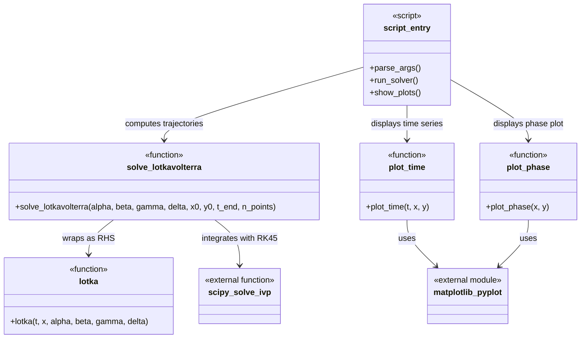
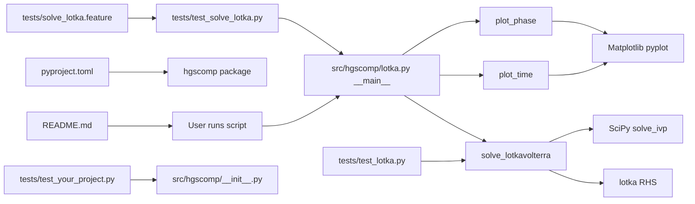

# HGSComp Lotka-Volterra Example Overview

> **Summary:** This repository is a small Python exercise project for the HGS MathComp Retreat 2026. Its current production code centers on `src/hgscomp/lotka.py`, which implements the Lotka-Volterra right-hand side, a SciPy-based solver, plotting helpers, and a script-style command-line interface for producing population trajectory plots.

## Repository map

```text
.
├── AGENTS.md                  # Contributor guidance for coding agents and project workflow
├── COPYING.md                 # Copyright holder list
├── LICENSE.md                 # MIT license text
├── README.md                  # Workshop/project overview and equation statement
├── pyproject.toml             # Python package metadata, dependencies, setuptools, pytest config
├── scout/                     # Generated repository overviews
├── src/
│   ├── hgscomp/               # Installable Python package
│   │   ├── __init__.py        # Empty package initializer
│   │   └── lotka.py           # Lotka-Volterra solver, plotting helpers, and script entry point
│   └── hgscomp.egg-info/      # Generated editable-install/package metadata; not source of truth
├── tests/
│   ├── conftest.py            # Currently empty pytest fixture file
│   ├── solve_lotka.feature    # Gherkin behavior scenarios for the Lotka CLI
│   ├── test_lotka.py          # Numerical/unit tests for solve_lotkavolterra
│   ├── test_solve_lotka.py    # pytest-bdd step definitions and subprocess CLI checks
│   └── test_your_project.py   # Template test still expecting hgscomp.add_one
├── .pi/                       # Pi coding-agent skill metadata, including repo-exploration skill
├── .venv/                     # Local virtual environment; generated and environment-specific
├── .vscode/                   # Local editor settings
├── .pytest_cache/             # pytest cache; generated
└── .git/                      # Git repository metadata
```

No CI workflow directory such as `.github/workflows/` is present in the inspected checkout.

## Tech stack and paradigms

| Area | Technologies | Dominant paradigms |
|---|---|---|
| Python package | Python 3.10+, setuptools via `pyproject.toml`, `src/` layout | Small procedural/numerical library module with script-style CLI |
| Numerical computation | NumPy, SciPy `solve_ivp` | Functional numerical code: pure RHS function plus integration wrapper |
| Visualization | Matplotlib | Immediate plotting through pyplot helpers |
| Testing | pytest, pytest-bdd feature file/step definitions, NumPy assertions | Unit tests for numerical invariants and BDD-style behavior tests for CLI expectations |
| Agent/workshop docs | `README.md`, `AGENTS.md`, `.pi/skills/` | Exercise-oriented development with TDD/BDD emphasis |

## Class/function diagram



## Class, struct, and important-function descriptions

There are no production classes or structs in the current codebase. Important free functions are:

- **`lotka(t, x, alpha, beta, gamma, delta)`** in `src/hgscomp/lotka.py`: computes the Lotka-Volterra right-hand side as `[alpha*x - beta*x*y, delta*x*y - gamma*y]` for state vector `x = [prey, predator]`. The `t` argument is accepted for compatibility with SciPy ODE solver callbacks.
- **`solve_lotkavolterra(...)`** in `src/hgscomp/lotka.py`: constructs an evenly spaced `numpy.linspace` time grid, calls `scipy.integrate.solve_ivp` over `[0, t_end]` with method `RK45`, and returns `(sol.t, sol.y[0], sol.y[1])`.
- **`plot_time(t, x, y)`** in `src/hgscomp/lotka.py`: plots both populations against time with labels and a legend, then calls `plt.show()`.
- **`plot_phase(x, y)`** in `src/hgscomp/lotka.py`: plots the predator/prey phase curve `y(x)`, labels axes, then calls `plt.show()`.
- **Script block in `src/hgscomp/lotka.py`**: when run as `python src/hgscomp/lotka.py`, parses required numeric arguments `--alpha`, `--beta`, `--gamma`, `--delta`, `--x0`, `--y0`, and `--t`; if no arguments are provided, it emits a custom Lotka-Volterra error message and exits with code 1.

## Module diagram



## Module descriptions

### `src/hgscomp/`

- `src/hgscomp/lotka.py`: the main production module. It contains numerical model code, plotting code, and the current CLI script block in one file.
- `src/hgscomp/__init__.py`: empty package initializer. It does not currently re-export `lotka`, `solve_lotkavolterra`, or any helper functions.

### `tests/`

- `tests/test_lotka.py`: imports `solve_lotkavolterra` and verifies equilibrium behavior for the origin and the nontrivial Lotka-Volterra fixed point `(gamma/delta, alpha/beta)`.
- `tests/solve_lotka.feature`: describes user-facing CLI behavior in Gherkin: successful parameterized plotting and an error path for missing parameters.
- `tests/test_solve_lotka.py`: binds the feature file to pytest-bdd step definitions. It loads `src/hgscomp/lotka.py`, runs it in subprocesses, and checks for `plot_time`/`plot_phase` helpers and missing-argument behavior.
- `tests/conftest.py`: present but empty; no shared fixtures are defined yet.
- `tests/test_your_project.py`: a leftover template test that imports `hgscomp` and expects `hgscomp.add_one(1) == 2`, which does not match current package contents.

### Configuration and metadata

- `pyproject.toml`: declares package name `hgscomp`, version `0.0.1`, Python requirement `>=3.10`, runtime dependencies `matplotlib`, `numpy`, `pyyaml`, and `scipy`, optional test dependencies `pytest` and `pytest-cov`, setuptools package discovery under `src`, and pytest `testpaths = ["tests"]`.
- `AGENTS.md`: instructs contributors to keep changes focused, use NumPy-style docstrings, install with `pip install -e '.[tests]'`, and run tests with `pytest`.

## Reading order and entry points

1. Read `README.md` for the workshop context, target Lotka-Volterra equations, and exercise structure.
2. Read `AGENTS.md` for repository-specific coding-agent and testing expectations.
3. Read `src/hgscomp/lotka.py` top to bottom: solver, plotting helpers, RHS function, then `if __name__ == "__main__"` CLI behavior.
4. Read `tests/test_lotka.py` beside `solve_lotkavolterra` to understand the numerical invariants currently tested.
5. Read `tests/solve_lotka.feature` and `tests/test_solve_lotka.py` together to understand intended CLI behavior and current behavior-test expectations.
6. Treat `tests/test_your_project.py` as a template/remnant unless the project intentionally adds `hgscomp.add_one`.

Primary entry points:

- **Library solver:** `from hgscomp.lotka import solve_lotkavolterra`.
- **RHS function:** `from hgscomp.lotka import lotka`.
- **Script CLI:** `python src/hgscomp/lotka.py --alpha 1 --beta 0.1 --gamma 1.5 --delta 0.075 --x0 10 --y0 10 --t 10`.
- **Test runner:** `pytest`, configured by `pyproject.toml` to discover tests under `tests/`.
- **CI entry point:** none found in this checkout.

## Tests and fixtures

| Test asset | Production code covered | Notes from inspection |
|---|---|---|
| `tests/test_lotka.py` | `src/hgscomp/lotka.py::solve_lotkavolterra` and indirectly `lotka` | Verifies zero equilibrium, nontrivial fixed point, and output length using NumPy `allclose`. |
| `tests/solve_lotka.feature` | Intended CLI behavior of `src/hgscomp/lotka.py` | Specifies required CLI arguments without `--t`, successful trajectory/phase plotting, and custom error behavior for missing parameters. |
| `tests/test_solve_lotka.py` | Script execution, `plot_time`, `plot_phase`, missing-argument error path | Uses subprocesses and pytest-bdd. The implemented CLI currently requires `--t`, while the BDD scenario omits it. |
| `tests/test_your_project.py` | `src/hgscomp/__init__.py` / package API | Currently fails because `hgscomp.add_one` is not implemented or exported. |
| `tests/conftest.py` | Shared pytest fixtures | Empty at inspection time. |

Verified local `pytest -q` result in the current environment: 5 tests collected, 3 passed, 2 failed. The failures are the BDD CLI success scenario missing required `--t`, and `test_your_project.py` expecting nonexistent `hgscomp.add_one`.

## How to build, run, and test

### Environment notes

The active local interpreter is the repository virtual environment at `.venv/bin/python`, reporting Python 3.14.6. This venv can run pytest, but `python -m pip` is not installed in it. The system has `uv 0.11.24`, and `uv pip install --dry-run -e '.[tests]'` successfully resolved the editable package and test extra.

### Install package and test dependencies

The repository guidance in `AGENTS.md` says:

```bash
pip install -e '.[tests]'
```

In the inspected environment, use `uv` because the active venv has no pip module:

```bash
uv pip install -e '.[tests]'
```

Open question: `tests/test_solve_lotka.py` imports `pytest_bdd`, but `pyproject.toml` lists only `pytest` and `pytest-cov` under the `tests` extra. The current venv already has `pytest-bdd`; a fresh environment may need it installed separately until project metadata is updated.

### Run the CLI

Current implemented CLI requires `--t` in addition to the parameters mentioned in `AGENTS.md` and `tests/solve_lotka.feature`:

```bash
python src/hgscomp/lotka.py \
  --alpha 1 \
  --beta 0.1 \
  --gamma 1.5 \
  --delta 0.075 \
  --x0 10 \
  --y0 10 \
  --t 10
```

This command was verified with `MPLBACKEND=Agg` to avoid opening GUI windows; it exited with code 0 and emitted Matplotlib warnings that the noninteractive canvas cannot be shown. With a graphical backend, it opens Matplotlib windows via `plt.show()`.

The no-argument error path is:

```bash
python src/hgscomp/lotka.py
```

It exits nonzero and prints:

```text
Lotka Volterra equations need parameters alpha, beta, gamma, delta and initial conditions x0, y0
```

### Run tests

```bash
pytest -q
```

Current verified result: the command runs but fails 2 tests in this checkout for the reasons described in the test table above.

Focused examples:

```bash
pytest -q tests/test_lotka.py
pytest -q tests/test_solve_lotka.py
```

### Build package artifacts

No dedicated build backend command or CI build job is present beyond setuptools metadata in `pyproject.toml`. If the `build` package is installed, standard Python packaging would be:

```bash
python -m build
```

This command was not verified because the active venv lacks `pip` and no `build` dependency is declared in `pyproject.toml`.

## Documentation pointers

- `README.md`: workshop context, exercise list, and Lotka-Volterra equations.
- `AGENTS.md`: project purpose, setup/test instructions, source/test layout, and contributor constraints.
- `pyproject.toml`: authoritative package metadata, dependencies, optional test extra, and pytest discovery path.
- `tests/solve_lotka.feature`: readable behavior specification for the intended CLI experience.
- `LICENSE.md` and `COPYING.md`: MIT license and copyright holder information.

## Constraints, risks, and open questions

- `AGENTS.md` says to use NumPy-style docstrings; `solve_lotkavolterra` follows that style, while `lotka` has a shorter informal docstring and plotting helpers lack docstrings.
- The CLI contract is inconsistent across files: `AGENTS.md` and `tests/solve_lotka.feature` list `--alpha`, `--beta`, `--gamma`, `--delta`, `--x0`, and `--y0`, but `src/hgscomp/lotka.py` also requires `--t`.
- The BDD test `lotka_args` asserts `not hasattr(mod, "main")` while its failure message says "CLI entry point missing"; clarify whether a `main()` function is desired.
- `pyproject.toml` test extras omit `pytest-bdd`, although behavior tests require it.
- `tests/test_your_project.py` appears to be leftover template code and currently fails against the actual package API.
- `src/hgscomp.egg-info/`, `.pytest_cache/`, `.venv/`, and `tests/__pycache__/` are generated/local artifacts in the checkout; changes should generally target source, tests, and project metadata instead.
- Plotting functions call `plt.show()` directly, which can block in interactive environments and complicate automated CLI tests unless a noninteractive backend or mocking strategy is used.
- No CI configuration was found, so automated test/build expectations outside local pytest are an open question.
